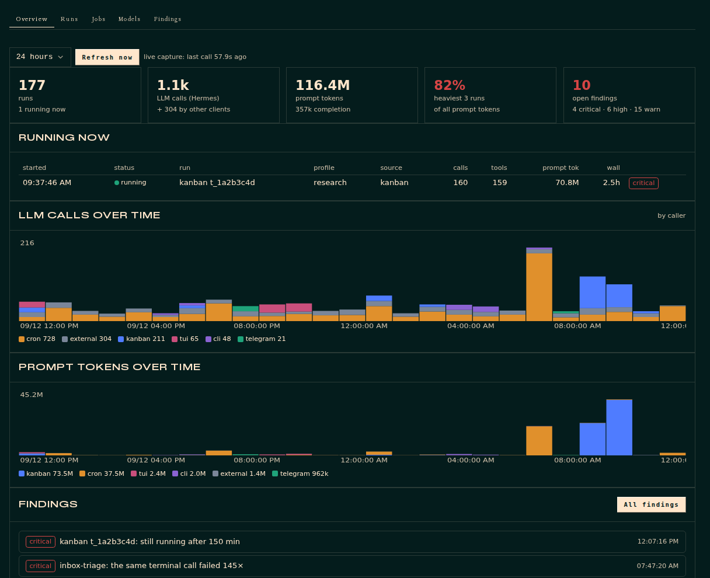
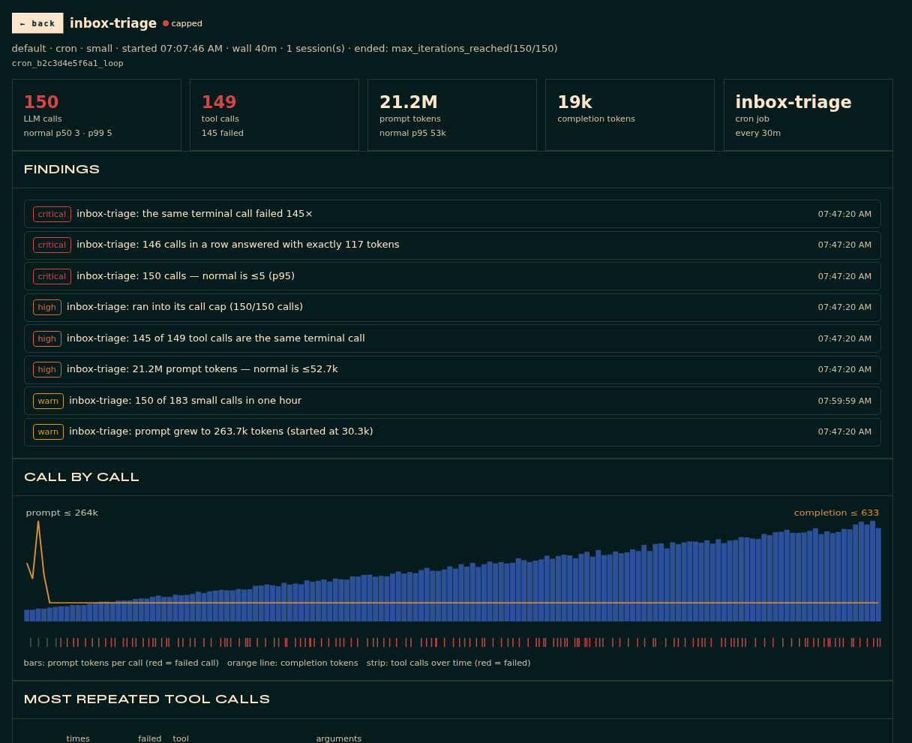
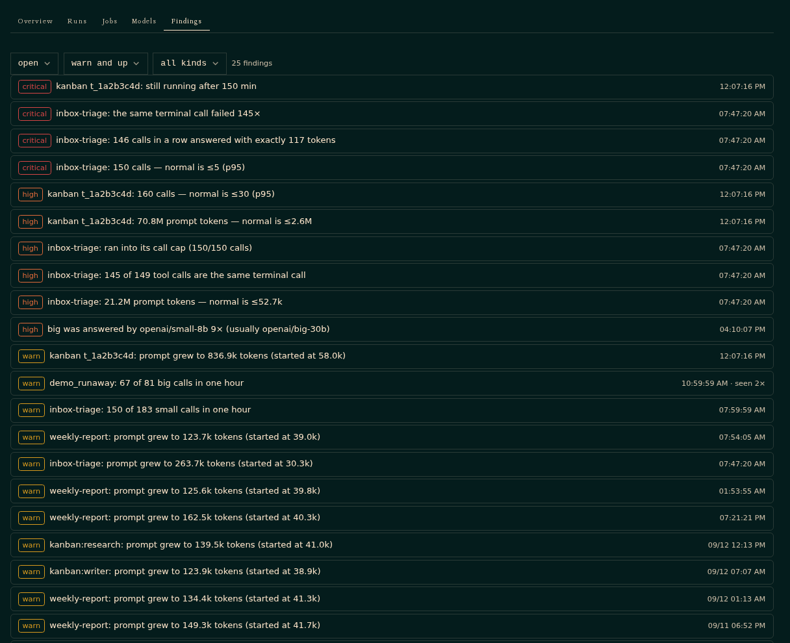
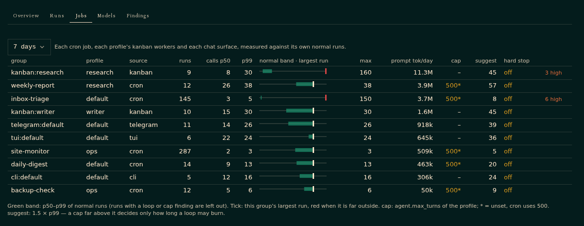
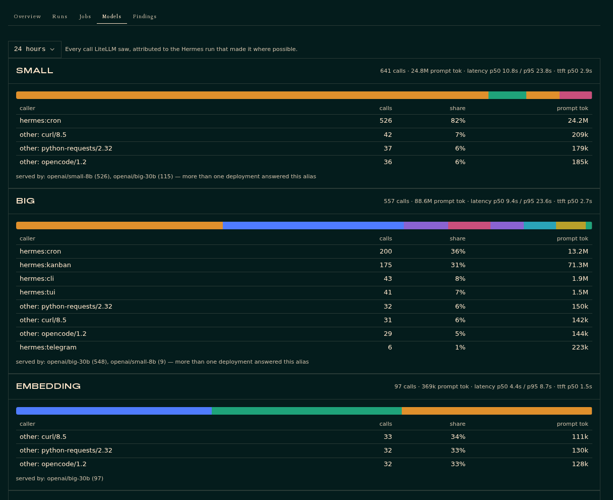

# hermes-run-lens

See every [Hermes Agent](https://github.com/NousResearch/hermes-agent) run the way the
machine experienced it — each LLM call with its prompt size, latency, time to first
token and the deployment that really answered; each tool call with its arguments,
result and duration — find loops, runaways and silent fallbacks against each job's own
normal runs, and stop one run without restarting the gateway.



## Why

Hermes records everything needed to see a run go wrong, but in places that do not know
about each other: session totals in `state.db`, individual calls in `agent.log`, what
the model server actually did in LiteLLM's spend logs, scheduler decisions in cron's
execution store. On the machine this was built for, two cron runs looped for three
hours one evening — one repeated a refused write 500 times, the other re-ran a failing
Python snippet about 450 times — and took 890 of the day's 1,142 calls on a shared
local model. Both were marked `completed`. Nobody noticed until someone asked why the
model was slow.

run-lens puts those sources into one store, watches every run as it happens, and says
so when a run stops looking like its own history.

## What you get

**A Runs tab in the Hermes dashboard** — overview, runs, jobs, models, findings, and a
page per run with its calls drawn one by one.

| | |
|---|---|
|  |  |
|  |  |

**`hermes lens`** — the same in the terminal:

```
hermes lens                        the last day: runs, calls, tokens by caller, running now, findings
hermes lens runs --active          what is running right now
hermes lens run <id | job name>    one run call by call: prompt growth, latency, served model, repeated tool calls
hermes lens jobs                   per job: calls p50/p99, largest run, tokens/day, configured cap vs suggested cap
hermes lens models                 per model group: callers, deployments that answered, latency and TTFT
hermes lens findings               what needs a look  (ack / resolve <id>)
hermes lens stop <run>             interrupt a live run from outside its process
hermes lens setup                  create the watch cron job (no LLM; silent unless something is wrong)
hermes lens doctor                 is capture live in every profile; LiteLLM detection; settings
hermes lens export --to-monitoring OpenTelemetry GenAI spans to the collector Hermes already exports to
hermes lens demo --db /tmp/demo.db a synthetic store to try all of this without real data
```

**`/lens`** inside a chat: the last hour at a glance.

## How it works

**Live capture, in every agent process.** Hooks — `pre_api_request`, `post_api_request`,
`api_request_error`, `pre_tool_call`, `post_tool_call`, `on_session_start`,
`on_session_end`, `on_session_finalize`, `subagent_stop` and the kanban lifecycle — copy a
few fields into an in-memory queue; one writer thread per process flushes to SQLite
about once a second. The hooks never block and never fail an agent: a locked or broken
store drops rows with a warning. In a multiplexed gateway every profile shares one
recorder.

**History, and processes without the plugin.** Incremental ingesters read `state.db` of
every profile (sessions, compression chains joined into runs, tool calls rebuilt from
messages), `agent.log` and its rotations (per-call tokens and latency, turn exits,
compression, cron scheduler decisions), cron jobs and executions, kanban task runs, and —
if there is one — LiteLLM's spend logs.

**LiteLLM, when present.** Every provider `base_url` in the Hermes configs is probed once
with `/health/liveliness`. Requests to a detected proxy carry the Hermes session and call
id in `metadata.spend_logs_metadata`, so each spend-log row joins its call exactly and
brings the served deployment and time to first token; history is matched by model group,
token counts and end time. Calls from other clients on the same proxy show up as their
own callers. Without LiteLLM, all of this is skipped.

**Findings**, judged against each group's baseline — p50/p95/p99 of finished runs of the
same cron job, the same profile's kanban workers, or the same chat surface, over 14 days,
with capped and looping runs left out:

| kind | when |
|---|---|
| `cap.max_iterations`, `cap.guardrail_halt` | a turn ended at its call cap or the loop guardrail — with the cap its normal runs suggest |
| `loop.exact_failure` | the same tool call (same arguments) failed ≥ 5 times |
| `loop.repeated_call` | most of a run's tool calls share one argument shape |
| `loop.identical_output` | ≥ 10 consecutive replies of exactly the same size |
| `runaway.calls`, `runaway.tokens` | far beyond the group's p95 / p99 |
| `runaway.active` | a cron or kanban run is live after 3 × its group's usual wall time |
| `bloat.prompt` | a call's prompt passed 120k tokens |
| `model.fallback` | a model group was answered by a deployment that is not its usual one |
| `model.hog` | one run made most of a model's calls in an hour |
| `cron.overlap` | fires skipped because the previous run was still going |
| `compression.churn`, `api.errors`, `waste.settle`, `kanban.failed` | as named |

**The stop, and the breaker.** `hermes lens stop <run>` (or the dashboard's button) writes a
stop request; every process with the plugin polls for them every four seconds, finds the
running agent in memory, calls its `interrupt(hard_cancel=True)` — the path `/stop` uses —
and blocks further tool calls with a message telling the model to end its turn. A
middleware cannot do this: Hermes logs a raising middleware and makes the call anyway. The
**breaker** does the same on its own when the recorder sees a cron run repeat one failing
tool call, repeat one reply, or run far past its normal size.

## Install

Requires Hermes Agent **0.20** or newer (hooks, middleware and plugin CLI commands).
Tested with v0.20.4.

```bash
hermes plugins install gweber/hermes-run-lens/hermes-plugin
hermes plugins enable run-lens
hermes lens ingest                 # read the history you already have
hermes lens setup --deliver telegram:<chat_id>    # optional: be told when a run goes wrong
```

Restart the gateway and the dashboard so they load the plugin. CLI chats and kanban
workers pick it up on their next start.

**Profiles.** Hermes enables plugins per profile. For live capture in a profile's own
processes (its CLI chats, its kanban workers), add `run-lens` to that profile's
`plugins.enabled` and make the plugin visible there (`profiles/<name>/plugins/run-lens`).
Cron runs of multiplexed profiles execute in the gateway and are captured with the default
profile. `hermes lens doctor` shows which profiles are live.

**Development install:** `ln -s "$PWD/hermes-plugin" ~/.hermes/plugins/run-lens`.

## Configuration

Everything is optional. Settings live under the plugin's entry in the default profile's
`config.yaml`; the full list with descriptions is the `config_schema` in
[`hermes-plugin/plugin.yaml`](hermes-plugin/plugin.yaml).

```yaml
plugins:
  entries:
    run-lens:
      settings:
        breaker: cron                       # off | cron | cron+kanban | all
        breaker_exact_failures: 12
        tag_litellm: auto                   # auto | on | off
        litellm_spend_source: auto          # auto | api | postgres | docker | off
        litellm_admin_key_env: LITELLM_MASTER_KEY      # the NAME of an env var
        litellm_docker_container: ""        # e.g. litellm-db
        retention_days: 90
        watch_deliver: local                # e.g. telegram:<chat_id>
        aux_notify: "off"                   # off | print | kanban
        aux_card_board: spark
        aux_card_assignee: ops
```

**Failing auxiliary tasks.** Background memory/skill reviews, title generation, context
summaries and auxiliary fallback chains fail without the user's turn noticing. run-lens
reads their failure lines from every profile's `agent.log`, groups them by profile, task
and a normalised error signature, and opens one finding per problem once it happens 3×
in 24 h (the paid OpenRouter lane: once). With `aux_notify: kanban` the watch job turns
each new one into a card on `aux_card_board` for `aux_card_assignee` instead of a message
(and prints it if the card cannot be created); `hermes lens watch --dry-run` shows what it
would create.

LiteLLM restricts its spend-log API to the proxy admin. `auto` uses, in order: the API if
the env var named by `litellm_admin_key_env` is set; the database if the env var named by
`litellm_postgres_dsn_env` is set and `psql` is installed; `docker exec` into
`litellm_docker_container`; otherwise nothing.

**Store.** One SQLite file for the whole install, `<default home>/plugin-data/run-lens/lens.db`
(`store_path` to move it). This is a deliberate departure from Hermes's per-profile
`plugin_data_dir`: a multiplexed profile's cron run executes and logs in the default
profile's process, so "what is using the model right now" only has an answer in one place.

## Try it without real data

```bash
hermes lens demo --db /tmp/run-lens-demo.db
RUN_LENS_DB=/tmp/run-lens-demo.db RUN_LENS_HERMES_ROOT=/tmp hermes lens --no-ingest
RUN_LENS_DB=/tmp/run-lens-demo.db RUN_LENS_HERMES_ROOT=/tmp hermes dashboard --port 9129
```

The screenshots above are that demo store.

## Development

```bash
pip install pytest pyyaml
python -m pytest -q tests/                                   # Hermes need not be installed
python tests/dump_fixtures.py --demo /tmp/rl-fixtures.json   # API responses from the demo store
npm install --no-save react@19 react-dom@19 jsdom@29
RUN_LENS_FIXTURES=/tmp/rl-fixtures.json node hermes-plugin/dashboard/render_check.js
```

The dashboard bundle is a plain IIFE against the host's plugin SDK — no build step;
`render_check.js` mounts every tab in jsdom and clicks through the run detail, the stop
button and the finding actions.

```
hermes-plugin/
  __init__.py  plugin.yaml          hooks, middleware, `hermes lens`, `/lens`; config_schema
  run_lens/
    recorder.py control.py          live capture, live loop detection, breaker, cross-process stop
    ingest/                         statedb, agentlog, litellm, cron, kanban
    baseline.py detect.py           group baselines, findings
    query.py cli.py export.py       read models; terminal; OpenTelemetry export
    settings.py paths.py store.py textutil.py fmt.py demo.py
  dashboard/                        manifest.json, plugin_api.py, dist/index.js, render_check.js
tests/
```

## Known limits

- Calls Hermes makes outside the hook path — context compression, title generation, the
  summary after a max-iterations stop — appear only in LiteLLM's logs, as unattributed
  Hermes traffic.
- Loop-guardrail warnings reach no hook; they are read from the stored tool result.
- A stop requested right after compression rotated a session id reaches the new id only
  after the next ingest.
- The agent log is parsed, not consumed through an API; a Hermes release that changes its
  log lines needs a parser update (the hooks are unaffected).

See [SECURITY.md](SECURITY.md) for what the store keeps and who can stop what.

MIT License.
